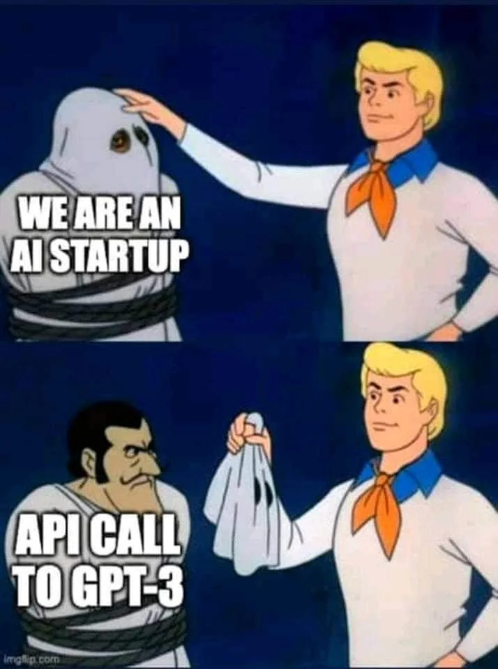


Utilisation des API d'intelligence artificielle générative pour la création d'un outil de gestion de contenu


## Introduction

On voit de plus en plus d'entreprises et de startups parler de leurs applications "propulsées par l’IA". Ça sonne impressionnant, mais en réalité, beaucoup de ces applications reposent sur des modèles déjà existants, accessibles simplement via des appels API. Ce n’est pas de la "magie", et ce n’est pas forcément aussi compliqué que ce qu’on pourrait croire. Si vous envisagez de créer une application utilisant de l'IA, il y a de fortes chances que vous n'ayez pas besoin de compétences en machine learning ni d'une équipe de data scientists !

Dans cet article, on va décrypter cette tendance et voir comment les entreprises utilisent des modèles de langage (comme ceux d’OpenAI ou de Google) pour créer leurs applications "IA" en toute simplicité.

### La réalité derrière les applications “IA” : quelques appels API

Alors, comment fonctionnent la majorité des applications dites "IA" ? Beaucoup d'entreprises se connectent simplement à des APIs de modèles de langage pré-entrainés, comme GPT d’OpenAI, qui est capable de comprendre et de générer du texte. L’API est une sorte de "télécommande" qui donne accès aux capacités du modèle sans avoir à s’occuper du code complexe et de l'entraînement derrière.

En pratique, voici ce que ça donne : un développeur envoie du texte (une question, une phrase, ou autre) à l’API, et celle-ci renvoie une réponse élaborée. Le tout est prêt à l’emploi et peut être intégré en quelques lignes de code. Par exemple :
- **Génération de contenu** : L’application peut générer des textes ou des suggestions en réponse à des besoins précis.
- **Analyse de texte** : Elle peut résumer des textes, extraire des informations ou déterminer si un avis est positif ou négatif.

Résultat : au lieu de créer un modèle d’IA complexe, on obtient des fonctionnalités “intelligentes” en un minimum de temps et d'efforts.

### Pourquoi tant d’entreprises adoptent les APIs d’IA ?

Utiliser une API pour intégrer de l’IA a plusieurs avantages, qui expliquent pourquoi tant d’entreprises le font :

1. **Gain de temps et d’argent** : Entraîner un modèle IA de zéro est coûteux et prend du temps. Avec une API, pas besoin de tout ça ; l’IA est accessible presque instantanément.

2. **Pas besoin d’être un expert** : Il suffit de savoir intégrer une API dans une application, ce qui est à la portée de n’importe quel développeur.

3. **Robustesse** : Les géants de la tech (OpenAI, Google, Anthropic…) mettent à jour leurs modèles pour les rendre plus performants. Utiliser leur API, c’est profiter de modèles toujours au top sans avoir à gérer la maintenance.

### Comment intégrer une API de modèle de langage dans une application ?

Voici comment ça se passe en général :

1. **Obtenir une clé API** : L’entreprise s’inscrit chez le fournisseur d’API (par exemple OpenAI), et reçoit une clé d’accès.
2. **Configurer l'API** : On ajoute cette clé dans l’application pour autoriser les appels API.
3. **Faire les appels API** : Quand l’application a besoin d’une réponse, elle envoie une requête (en langage naturel, souvent) à l'API qui renvoie une réponse en quelques millisecondes.
4. **Personnaliser l’expérience utilisateur** : En fonction de l’application, on peut "styliser" ou adapter les réponses reçues pour que ça colle au style ou à la fonction de l’application.

En quelques jours, une application peut être prête, sans passer par le casse-tête du développement IA traditionnel.

### API IA : des avantages, mais aussi des limites

Les APIs IA facilitent la création d’applis intelligentes, mais elles ne sont pas parfaites. Voici quelques éléments à prendre en compte :

- **Dépendance** : Vous êtes tributaire des fournisseurs. Une hausse de prix ou un changement de politique peut vous impacter.
  
- **Personnalisation limitée** : Même si les modèles de langage sont puissants, ils restent génériques. Pour des besoins très spécifiques, vous pourriez avoir besoin d’un modèle personnalisé (plus complexe à obtenir).

- **Confidentialité des données** : Les données que vous envoyez aux API peuvent être sensibles, alors attention aux politiques de confidentialité et de sécurité des fournisseurs.

### En conclusion

Créer une application IA n’a jamais été aussi simple grâce aux APIs de modèles de langage. En quelques appels, on peut enrichir une appli de fonctionnalités intelligentes, sans avoir besoin de toute la structure lourde d’un modèle IA maison. Cependant, même si c’est plus accessible, les entreprises doivent rester transparentes : la plupart des applications qui se disent "IA" reposent simplement sur des modèles déjà existants.

Alors, si vous voulez créer une appli IA, sachez que la technologie est à portée de main. Moins complexe, mais tout aussi puissant.