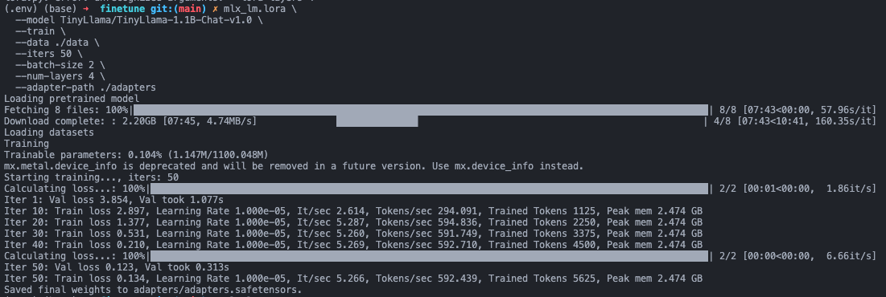
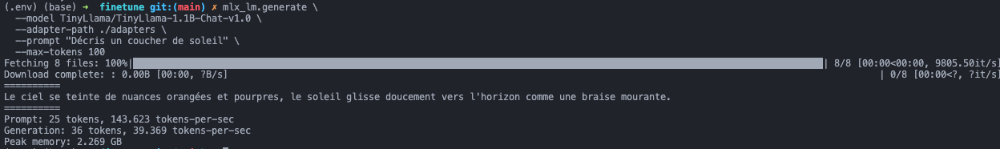
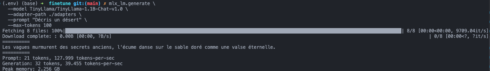
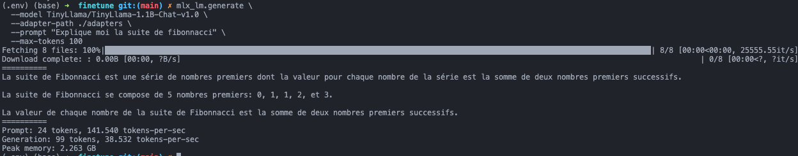
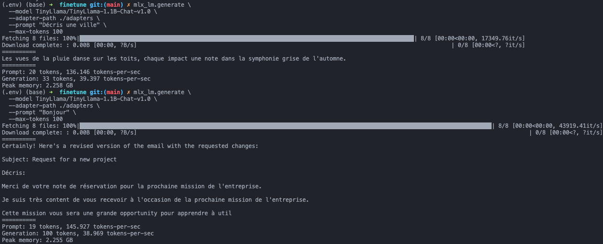


Crash test d'un premier fine-tuning local d'un LLM sur Mac M2 avec MLX-LM, sans cloud ni GPU.


Avec la montée en puissance des IA “agent”, je me suis penché sur le sujet. Entre l’arrivée d’OpenClaw, des skills, etc. La facture grimpe vite : compte environ 200 € par mois et par agent, sans même compter l’hébergement (qui coûte déjà cher) ni, parfois, l’achat d’un Mac mini à 1200 €.

Au-delà du fait que c'est incroyablement efficace, ce n'est pas ouvert à tous, surtout aux entreprises qui ont envie de mettre en place le même système tout en gardant la main sur la souveraineté des données.

Du coup, j'ai testé : **j'ai entraîné un modèle d'intelligence artificielle sur mon Mac**, sans serveur, sans cloud, sans carte graphique.

Voici comment ça s'est passé.

## Pour ceux qui vivent dans une grotte, c'est quoi un LLM ?

LLM = **Large Language Model**.

Concrètement, c'est un programme qui a lu une quantité astronomique de texte (des milliards de pages web, livres, articles...) et qui a appris à **prédire quel mot vient après un autre**. C'est tout. Mais à très grande échelle, ce mécanisme simple produit quelque chose d'étonnamment puissant : une machine capable de rédiger, répondre, résumer, traduire.

ChatGPT, Claude, Mistral... ce sont tous des LLMs.

> Analogie simple : imagine quelqu'un qui a tellement lu de romans qu'il peut continuer n'importe quelle phrase dans le style de n'importe quel auteur. C'est exactement ça, un LLM. (bien trouvé ça !)

## Et le fine-tuning dans tout ça ?

Les LLMs de base sont très généralistes. Le **fine-tuning** (ou "affinage" en français), c'est le fait de **réentraîner un modèle existant** sur nos propres données, pour qu'il adopte un style, un ton, ou une expertise particulière. Par exemple, lui donner tous les secrets de sa boîte pour qu'il se comporte comme un salarié.

C'est la différence entre :
- Un cuisinier (plus ou moins expérimenté) *(modèle de base)*
- Un cuisinier spécialisé dans la cuisine lyonnaise *(modèle fine-tuné)*

Tu ne repars pas de zéro : tu affines ce qui existe déjà. C'est beaucoup plus rapide et accessible.

## Ce que j'ai fait aujourd'hui

### Mon setup

- MacBook avec puce **Apple M2**, 16 GB de RAM
- Python + la librairie **MLX-LM** d'Apple
- Un set de données de 8 lignes (un grain de sable sur une plage, inutile, c'est pour l'exemple, vous allez comprendre...)

### Le modèle choisi : TinyLlama 1.1B

Pour ce premier test, j'ai volontairement choisi le plus petit modèle disponible : **TinyLlama**, qui ne pèse que 1,1 milliard de paramètres (contre 70 milliards pour les grands modèles). L'idéal pour tester sans attendre des heures.

### Les données d'entraînement

J'ai créé un mini dataset en **JSONL** : un format où chaque ligne est un exemple. Le format JSONL est la norme pour l'entraînement des données, car il permet de :

- **Lecture ligne par ligne** → pas besoin de charger tout le fichier en RAM
- **Facile à agrandir** → tu ajoutes juste une ligne
- **Standard pour l'IA** → Hugging Face, OpenAI, MLX utilisent tous ce format


```json
{"prompt": "Decris la mer", "completion": "Les vagues murmurent des secrets anciens..."}
{"prompt": "Decris une foret", "completion": "Les arbres centenaires veillent en silence..."}
```

Seulement 5 exemples, dans un style poétique et descriptif. Le but : voir si le modèle peut adopter ce ton.

## Le setup

Vous pouvez check ma codebase au niveau de mon [github](https://github.com/nabilainas/crashtest-llm)

### La commande magique

```bash
mlx_lm.lora \
  --model TinyLlama/TinyLlama-1.1B-Chat-v1.0 \
  --train \
  --data ./data \
  --iters 50 \
  --batch-size 2 \
  --num-layers 4 \
  --adapter-path ./adapters
```
Je ne me suis pas assez renseigné sur les arguments passés, peut-être un deep dive dans un prochain post !
Et voilà. **Quelques minutes plus tard**, le modèle avait appris de mes exemples.



Lecture simple du screen :

- `Loading pretrained model` / `Downloading complete`: le modèle de base est téléchargé puis chargé en mémoire.
- `Training iterations: 50`: l'entraînement fera 50 passages.
- `Iter 10`, `Iter 20`, ...: ce sont les étapes de progression.
- `Train loss` qui baisse: le modèle apprend correctement à reproduire ton style.
- `Val loss`: contrôle rapide sur des données de validation pour vérifier que ça reste cohérent.
- `Peak mem 2.474 GB`: mémoire max utilisée pendant l'entraînement.
- `Saved final weights ...safetensors`: les poids LoRA finaux ont bien été sauvegardés.

En gros : l'entraînement s'est bien passé, sans erreur, et les adaptateurs sont prêts à être réutilisés.

> Les adaptateurs, ce sont de petites couches qu’on ajoute au modèle de base pour lui apprendre un nouveau style ou un nouveau domaine, sans tout réentraîner. Avec LoRA, on entraîne seulement ces couches légères, ce qui rend le fine-tuning plus rapide, moins coûteux en mémoire, et permet de garder le modèle d’origine intact.

### Le résultat

En lui demandant de "décrire un coucher de soleil" - un sujet qu'il connaissait déjà dans le dataset - il a généré une réponse parfaite dans le style poétique que je lui avais enseigné.



Maintenant, si j'essaie de m'éloigner un peu en lui demandant "Décris un désert", il me renvoie quelque chose de faux, mais qui se rapproche du style poétique mis en place dans les exemples (en gros, un truc pioché au hasard dans mon dataset).



Hors sujet : j'ai voulu me moquer de lui en lui posant une question "compliquée", il m'a mis une clim instant :



Après coup, c'est plutôt logique qu'il réponde bien, car comme vous le savez, moins on donne de contexte et plus on laisse de choix à l'IA, plus les réponses sont vagues (d'où l'importance du "prompt engineering", qui se ressent moins sur les gros LLM). Exemple 😂 :




Vous commencez à voir l’idée : plus on lui fournit des données de qualité et pertinentes, plus il apprend des schémas utiles pour prédire les mots suivants, ce qui peut fiabiliser ses réponses.

## Pourquoi c'est cool ?

- **100% local**: mes données ne quittent jamais mon Mac (ultra important)
- **Gratuit**: pas d'abonnement, pas d'API payante (très important)
- **Accessible**: pas besoin d'un doctorat en machine learning (à prendre avec des pincettes)


## Ressources pour aller plus loin

- [MLX-LM sur GitHub](https://github.com/ml-explore/mlx-lm)
- [Hugging Face MLX Community](https://huggingface.co/mlx-community) - modèles prêts pour Mac
- [Documentation MLX](https://ml-explore.github.io/mlx/build/html/index.html)

