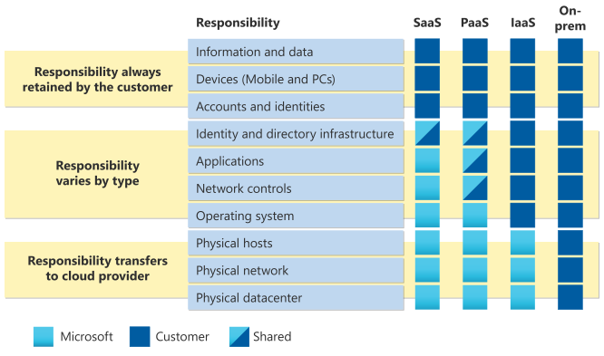


Intégration d'une application web dans une usine devops pour le déploiement continu


## Introduction

Dans le cadre de mes études, pour mon premier cours de M2 à [Sup De Vinci](https://www.supdevinci.fr/), nous avons eu pour objectif de déployer une application web dans le cloud, en privilégiant l'utilisation d'une approche DevOps concentrée sur le déploiement continu. 

Il y à une infinité de possiblités pour déployer une application, cependant, avec les contraintes imposées par le formateur et les potentiels point bonus on arrive à faire des choix

Concernant l'application en elle même, il n'y à pas de contraintes particulières etant donné que ce n'est pas le sujet principal de l'évaluation.
Cependant, On à des points bonus si on met en place certaines fonctionnalités.

Du côté du déploiement en lui même on nous encourage à :
- Provisionnement avec Terraform
- Configuration avec Ansible
- Monitoring avec Prometheus
- Visualisation avec Grafana
- Automatisation avec Jenkins, Gitlab CI ou Github Actions

et par rapport au bonus on à:
- Orchestration (Kubernetes) / Conteneurisation (Docker)
- Multi-cloud simultané
- Auto-scaling
- Backup / Disaster recovery

## Contexte et remarques

Pour faire simple, je vais expliquer comment on en est arrivés à choisir Azure Container Apps pour notre projet. Le contexte, c'est qu'on devait déployer une application sur le cloud, et on était un groupe de trois à plancher sur le sujet. Au départ, toute la classe (nous compris) s’est lancée dans l’idée de déployer un cluster Kubernetes, avec du Helm pour automatiser le déploiement. Ça semblait logique, mais on s’est vite rendu compte que ça posait pas mal de soucis.

D’abord, si on regarde bien le périmètre de notre besoin, on a juste une seule application à déployer. Monter un cluster Kubernetes pour ça, c’est un peu comme utiliser un marteau-pilon pour écraser une mouche : ça marche, mais c’est clairement surdimensionné. Ensuite, il y a le temps et la complexité du setup : configurer et déployer un cluster K8s, ça prend du temps, et avec une fenêtre de projet de 5 jours, on n’avait pas le luxe de perdre du temps sur des aspects d'infrastructure trop complexes.

Et puis, il y a la question du coût. On bosse avec des comptes Azure limités à 100 $ de crédits, et un cluster Kubernetes, ça peut bouffer rapidement ces crédits, surtout si on a besoin de faire des tests (créer, mettre à jour, détruire, recommencer). À ce rythme-là, on risque de cramer notre budget en un rien de temps, ce qui limite énormément nos possibilités de tests et d'itérations.

Mais si on avait seulement pris en compte le coût et le timing, ça n'aurait pas été assez justifié pour ne pas le faire, sachant que si on se speed un peu et qu'on est précis ça peut le faire ( Au final c'étais largement faisable car on à eu 1 semaine en plus pour finir le projet ). Il y a un autre point important : le besoin de contrôle sur l’application. Certaines entreprises préfèrent garder la main sur leur déploiement, le stockage des images, les certificats, la gestion des ports, etc., au lieu de se reposer sur un modèle où la responsabilité est partagée avec le fournisseur cloud. Bref, avoir le contrôle peut être essentiel.

Finalement, on a donc opté pour deux approches différentes (vu qu'on avait beaucoup + de temps ), pour couvrir les deux cas d'usage. 

1. **Premier cas d’usage** : utiliser Azure Container Apps. Cette plateforme cloud est pensée pour simplifier le déploiement d'applications conteneurisées, avec un modèle de responsabilités partagées qui nous libère de pas mal de tâches de gestion. Avec Azure Container Apps, le TTM (time-to-market) est plus rapide, et ça demande moins de maintenance et de configurations complexes. Cette approche est surtout adaptée aux équipes de développement qui veulent se concentrer sur le code et la logique de l'app plutôt que sur l'infrastructure.

2. **Deuxième cas d’usage** : rester sur Kubernetes pour un environnement où on veut un contrôle total de l'infra. Là, on gère tout de A à Z : le cluster, le stockage, les certificats, la configuration des ports, etc. C’est une option plus lourde en gestion, mais nécessaire si on a besoin de cette flexibilité et indépendance totale.

## Azure Containers Apps
### Architecture

Voici l'architecture globale du projet :

### Repository

vous pouvez avoir accès à la totalité du code en public [ici](https://gitlab.com/webapp6384540/deploy/-/tree/main)