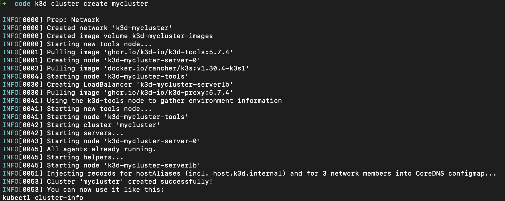
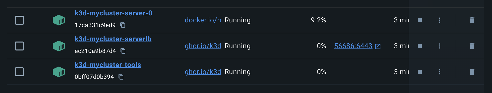


Post configuration avancée d'outils sur un cluster kubernetes



# Contexte 
Le but du projet est de mettre en place et gérer des pipelines CI/CD relativement complexes en utilisant Docker, Terraform, GitLab CI/CD, Kubernetes, ArgoCD, et Helm.
Il tient compte des connaissances que vous avez acquises au cours des années précédentes sur une grande partie de ces différentes technologies. Les consignes du projet, en deux parties. L'objectif est de voir deux modèles de CI/CD différents, un en mode "push" (Gitlab CI/CD), un en mode "pull" (GitOps)

On va travailler sur differents environnemets, local et prod :

 - k3d pour le développement local
 - Azure Kubernetes Service (AKS) pour la production

Il est divisé en 2 parties :
Partie 1: CI/CD avec GitLab et Kubernetes
Partie 2: CI/CD avec ArgoCD


Plus de détails [ici](https://gitlab.com/examens_tsaquet/projet-ci-cd-m2-do-2024)


# Configuration de l'environnment local (MAC)

k3d is a lightweight wrapper to run k3s (Rancher Lab’s minimal Kubernetes distribution) in docker.

Prérequis 🔑
| Outil    | Version | lien                                                              |
|----------|---------|-------------------------------------------------------------------|
| Homebrew | 4.4.6   | [ici](https://brew.sh/)                                           |
| Docker   | 25.0.3  | [ici](https://docs.docker.com/desktop/setup/install/mac-install/) |
| helm     | 3.16.3  | [ici](https://formulae.brew.sh/formula/helm)                      |

L'installation de k3d va se faire avec l'utilisation du package manager homebrew sur mac, pour cela on lance la commande :

```bash
brew install k3d
```

Après avoir lancé docker, on lance la commande :

```bash
k3d cluster create mycluster
```




# Connexion de l'agent local avec Gitlab


# Déploiement de l'application en local

argo cd

```bash
kubectl create namespace argocd                                                                    
kubectl apply -n argocd -f https://raw.githubusercontent.com/argoproj/argo-cd/stable/manifests/install.yaml
kubectl -n argocd get secret argocd-initial-admin-secret -o jsonpath="{.data.password}" | base64 -d
```
```bash
kubectl port-forward svc/argocd-server -n argocd 8888:443 
````

```bash
kc create namespace ocf-core-namespace
kubectl create secret docker-registry gitlab-registry-secret -n ocf-core-namespace --docker-server=registry.gitlab.com --docker-username=nabilainas --docker-password=TOKEN   --docker-email=EMAIL
```

```bash
kubectl port-forward svc/argocd-server -n argocd 8888:443 
kubectl -n argocd get secret argocd-initial-admin-secret -o jsonpath="{.data.password}" | base64 -d
```


